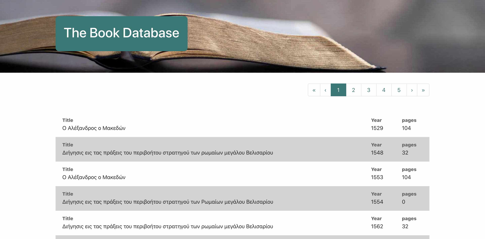

## Book database

My Book database webapp displays 100 books per page. Using pagination, you can navigate through these pages; one page at a time, or even 10 pages at a time

Packages used: axios, bootstrap, react-router, sass

## To run/view this project

In the project directory, you can run:

### `npm start`

Runs the app in the development mode. 
Open [http://localhost:3000](http://localhost:3000) to view it in the browser.

### Desktop View

